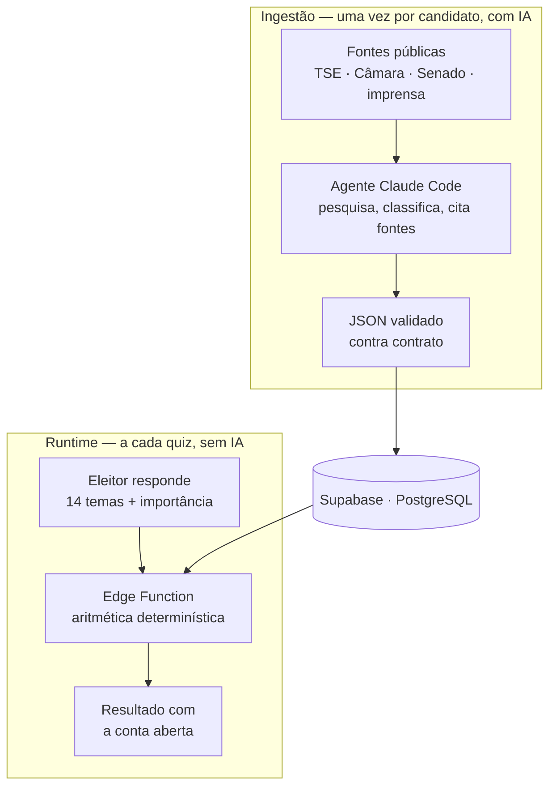

# VotoSim

Compara as respostas de um eleitor a 14 perguntas políticas com as posições
documentadas de cada candidato e mostra o percentual de afinidade — **com a
conta aberta**, para o eleitor conferir de onde saiu o número.

Duas decisões definem o projeto:

- **A IA interpreta uma vez, na ingestão. O match não usa IA.** O que o eleitor
  vê é aritmética determinística: mesmas respostas, mesmo resultado, sempre.
- **Não saber tem custo.** Um tema em que o candidato não se pronunciou entra na
  conta valendo 10%, contra os 50% de quem se pronunciou sem tomar partido. Quem
  publica um programa explícito pontua mais alto que quem evita se comprometer,
  e isso é deliberado.

## Como funciona



O trabalho caro acontece na ingestão e fica guardado. O runtime só lê e calcula,
o que mantém o app rápido, barato e — o que mais importa — **auditável**: cada
card mostra a conta que produziu o percentual, e ela fecha na mão.

Detalhes da fórmula, dos níveis de evidência e das duas métricas de cobertura
estão em [`docs/referencia/calculo-do-match.md`](docs/referencia/calculo-do-match.md).

## Módulo de ingestão de candidatos

**É por aqui que um parceiro começa.** [`modules/ingest-candidates/`](modules/ingest-candidates/)
é um pacote auto-contido para pesquisar candidatos e alimentar a base: comandos,
contrato de validação, testes e o procedimento que o agente de pesquisa segue.

Ele funciona dentro do repositório e também sozinho, empacotado em ZIP, para
quem não tem acesso ao repositório completo.

O tamanho do trabalho, em números de hoje: **20.004 candidaturas registradas,
133 pesquisadas.**

Como usar, o passo a passo e o aviso de segurança sobre credenciais estão no
[README do módulo](modules/ingest-candidates/README.md). **Leia-o antes de rodar
qualquer comando.**

## Documentação

Toda em `docs/`, dividida **pelo modo de leitura**, não pelo assunto:

| Pasta | O que guarda | Quando ler |
|---|---|---|
| [`referencia/`](docs/referencia/) | Como a plataforma funciona hoje | Consultar um fato específico |
| [`procedimentos/`](docs/procedimentos/) | Como executar algo, por pessoa ou agente | Antes de executar, do início ao fim |
| [`registros/`](docs/registros/) | O que foi descoberto operando o sistema, com data | Saber se uma anomalia já apareceu |
| [`migracoes/`](docs/migracoes/) | Os `.sql` aplicados ao banco | Entender ou reproduzir o schema |
| [`legado/`](docs/legado/) | Documentação superada | Só como histórico — **nada ali é confiável** |

**Todo documento declara a própria validade no topo** — status, data real da
última atualização e um resumo do que cobre. Leia esse bloco antes de confiar no
arquivo: nome de arquivo não é evidência.

Índice completo em [`docs/README.md`](docs/README.md).

## Subir a aplicação

**Pré-requisitos:** Node.js recente e acesso ao projeto Supabase (URL + chaves).

```bash
npm install

# Credenciais: Supabase → Project Settings → API
cp .env.example .env.local   # preencha as duas variáveis NEXT_PUBLIC_

npm run dev
```

Abra **http://localhost:3000** — a home redireciona para `/quiz`.

`npm run dev` sobe direto contra o Supabase remoto do `.env.local`; não precisa
de Supabase local nem da CLI. O diretório `supabase/` existe para a Edge Function
de matching, não para rodar o app.

**Se `/quiz` carregar sem candidatos:** a base pode não ter candidatos ingeridos
para aquele cargo e estado. Ver o módulo de ingestão acima.

Ambiente completo e ordem de deploy em
[`docs/procedimentos/`](docs/procedimentos/).

## Este NÃO é o Next.js que você conhece

A versão usada aqui (16.2.9) tem breaking changes em relação ao que consta em
dados de treinamento de modelos. **Leia `node_modules/next/dist/docs/` antes de
escrever código**, e confira ali a API que você pretende usar em vez de confiar
na memória. Exemplos que já morderam: `params` de página é uma `Promise` e
exige `await`, e o typecheck da build sai do `tsconfig.app.json`, não do
`tsconfig.json` da raiz.
